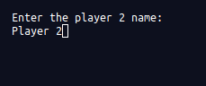
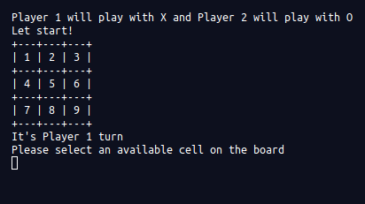
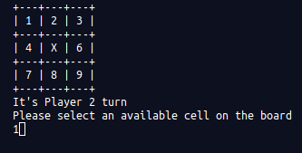

# Tic-Tac-Toe_Ruby-project

> In this project we are going to make Tic-Tac-Toe game using Ruby.

- Player 1 name input :

- Player 2 name input :

- Start the game :

- Player 1 turn :

- Player 2 turn :

- Gameover anounce winner :

This project is a tic-tac-toe game on the command line where two human players can play against each other, and the board is displayed in between turns.

## Built With

-Ruby

## Live Demo

[Live Demo Link](https://replit.com/@safaaballagh/Tic-Tac-ToeRuby-project#.replit)

## Getting Started

### Prerequisites
 - Ruby installed 

### Setup

 - To download this repository go on this page [Tic-Tac-Toe](https://github.com/ShinobiWarior/Tic-Tac-Toe_Ruby-project) and click on the Code button
- Then you can choose to download it as a ZIP file or copy HTTPS/ssh address and clone it using Terminal or Bash in your local machine.
- Enter the file of the Repository with your Terminal/Bash and run "./bin/main.RB"
 
-To run it remotely you can follow the link [Tic-Tac-Toe-Game](https://replit.com/@safaaballagh/Tic-Tac-ToeRuby-project#.replit)
 
## RULES FOR TIC-TAC-TOE
 
1. The game is played on a grid that's 3 squares by 3 squares marked by numbers from 1 to 9
 
2. The first player is X, the second one is O. Players take turns putting their marks in empty squares typing in a number of the square they choose.
 
3. The first player who gets 3 of his/her marks in a row (up, down, across, or diagonally) is the winner.
 
4. When all 9 squares are full, the game is over. If no player has 3 marks in a row, the game ends in a draw.

If you want extra information about the game rules, check this link from [Wikipedia](https://en.wikipedia.org/wiki/Tic-tac-toe)
 
## Authors

👤 **Safa Aballagh**

- GitHub: [@Safafa](https://github.com/safafa)
- Twitter: [@safa aballagh](https://twitter.com/Aballagh_S)
- LinkedIn: [Aballagh Safa](https://www.linkedin.com/in/aballaghsafa/)

👤 **Aleksandar Ivezic**

- GitHub: [@Aleksandar Ivezic](https://github.com/ShinobiWarior)
- Twitter: [@AIvezic](https://twitter.com/AIvezic)
- LinkedIn: [Aleksandar Ivezic](https://www.linkedin.com/in/aleksandar-ivezi%C4%87-1a6b0391/)

## 🤝 Contributing

Contributions, issues, and feature requests are welcome!

Feel free to check the [issues page](https://github.com/ShinobiWarior/Tic-Tac-Toe_Ruby-project/issues).

## Show your support

Give a ⭐️ if you like this project!

